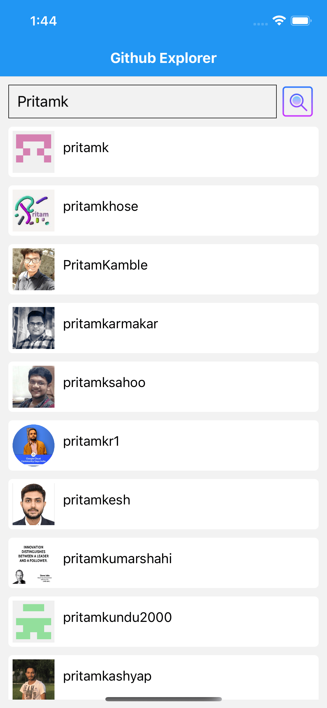
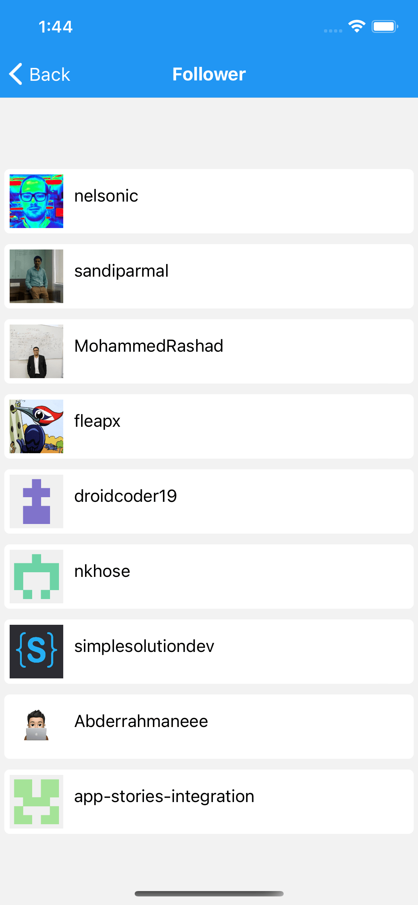

# Github Explorer Typescript React Native
Github Explorer Typescript React Native App using Github Rest API web services

Introduction
------------

The goal of this React Native Typescript application is to implement interface with Github REST API web service. 
It provide feature like search User's and it's details, along with list of user's Repositories, Followers and Following.

Getting Started
---------------
This project uses the npm, pod, Gradle build system. To build this project, use the
`npm install` command in [Visual Studio Code](https://code.visualstudio.com/download) or Getting Started with React native typescript project
```sh
npx react-native init GithubExplorerReactNative --template react-native-template-typescript
```

Project command
---------
To run this project, use `npm run android` or `npm run ios`.
if need clean this project, use `npm run android-clean` or `npm run ios-clean`.

| npm run ... | Description |
| --- | --- |
| android | Run android development-mode on simulator or phone |
| android-debug | Build android .apk with “Debug” configuration |
| android-release  | Build android .apk with “Release” configuration  |
| android-clean | Fix building android if preDexDebug error on Windows OS|
| android-clean-mac | Fix building android if preDexDebug error on Mac or linux OS |
| android-bundle | Bundle with entry file index.android.js |
| adb-reverse | Reset port ADB to tcp:8081 |
| adb-uninstall | Uninstall android .apk with “Debug” configuration port ADB to tcp:8081 |
| ios | Run iOS project with Simulator |
| ios-pod-install | install depedenceny for iOS project |
| ios-clean | Fix building ios if preDexDebug error|
| ios-release  | Build android .ipa with “Release” configuration  |
| ios-bundle | Bundle with entry file index.ios.js |
| ios-pod-clean | clean xcode & pod building |
| node-clean| clean node modules |
| test  | jest testing  |
| lint | lint testing |

To fix cocapad pod install issue fix by command where more info [Github issue tracker](https://github.com/CocoaPods/CocoaPods/issues/10287) and [Youtube video](https://www.youtube.com/watch?v=zdv9qE4j-VU).
```sh
cd ios
sudo arch -x86_64 gem install ffi
arch -x86_64 pod install
cd ..
```

Github Documentation
---------
The official [Github Documentation REST API v3](https://developer.github.com/v3/) in details.

Screenshots
-----------





Libraries used
--------------
* [React Getting started](https://reactnative.dev/docs/getting-started)
* [Getting Started with TypeScript](https://reactnative.dev/docs/typescript)
* [React Navigation](https://reactnavigation.org/docs/getting-started/)
* [Colors](https://reactnative.dev/docs/colors)
* [Scrollview](https://www.tutorialspoint.com/react_native/react_native_scrollview.htm)
* [Splash-Screen](https://medium.com/@appstud/add-a-splash-screen-to-a-react-native-app-810492e773f9)
* [Handlebar Labs](https://medium.com/handlebar-labs/how-to-add-a-splash-screen-to-a-react-native-app-ios-and-android-30a3cec835ae)
* [FastImage caching](https://www.npmjs.com/package/react-native-fast-image)
* [App Icon Generator iOS & Android](https://appicon.co/)
* [Colors](https://reactnative.dev/docs/colors)
* [Android Image Asset Studio](https://developer.android.com/studio/write/image-asset-studio)


Axios references
--------------
* [React native with axios](https://betterprogramming.pub/managing-api-requests-http-https-in-react-native-using-axios-9ebf75cbca9b)
* [Example](https://gist.github.com/sheharyarn/7f43ef98c5363a34652e60259370d2cb)
* [Axios with react](https://shyr.io/blog/axios-with-react-for-making-requests)
* [Timeout](https://stackoverflow.com/questions/36690451/timeout-feature-in-the-axios-library-is-not-working)
* [Handling errors](https://stackoverflow.com/questions/49967779/axios-handling-errors)


Install npm dependencies
--------------
```sh
npm i react-native-splash-screen
npm i hammerjs
npm i react-native-reanimated react-native-gesture-handler react-native-screens react-native-safe-area-context @react-native-community/masked-view react-navigation react-navigation-stack

yarn add @babel/preset-env --dev
```

IDE setup
------------------------
For development, the latest version of [Android Studio](https://developer.android.com/studio/) is required. The latest version can be
downloaded from [Xcode](https://developer.apple.com/xcode/).


Upcoming features
-----------------
Updates will include many more feature and architectural pattern.