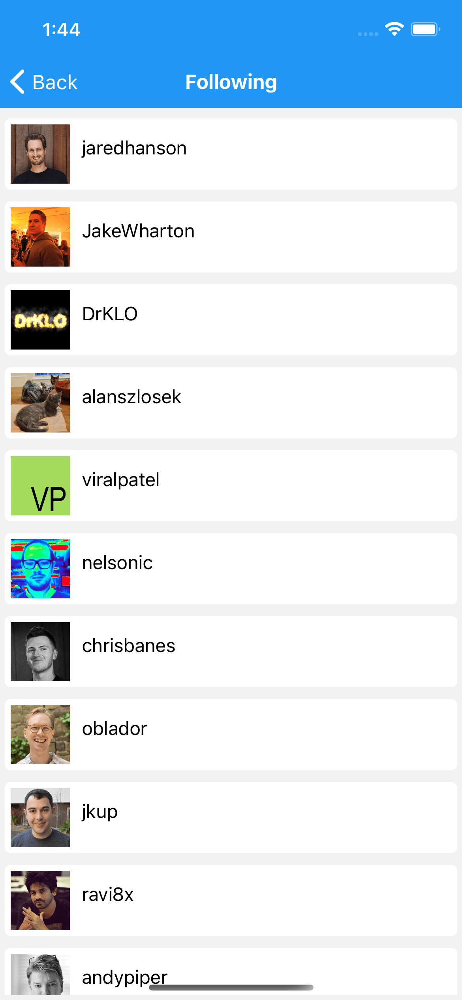

# Github Explorer Typescript React Native
Github Explorer Typescript React Native App using Github Rest API web services

Introduction
------------

The goal of this React Native Typescript application is to implement interface with Github REST API web service. 
It provide feature like search User's and it's details, along with list of user's Repositories, Followers and Following.

Getting Started
---------------
This project uses the npm, pod, Gradle build system. To build this project, use the
`npm install` command in [Visual Studio Code](https://code.visualstudio.com/download).

Github Documentation
---------
The official [Github Documentation REST API v3](https://developer.github.com/v3/) in details.

Screenshots
-----------

Libraries Used
--------------
* [React Getting started](https://reactnative.dev/docs/getting-started)
* [Getting Started with TypeScript](https://reactnative.dev/docs/typescript)
* [React Navigation](https://reactnavigation.org/docs/getting-started/)
* [Colors](https://reactnative.dev/docs/colors)
* [Scrollview](https://www.tutorialspoint.com/react_native/react_native_scrollview.htm)
* [Splash-Screen](https://medium.com/@appstud/add-a-splash-screen-to-a-react-native-app-810492e773f9)

IDE setup
------------------------
For development, the latest version of [Android Studio](https://developer.android.com/studio/) is required. The latest version can be
downloaded from [Xcode](https://developer.apple.com/xcode/).

Upcoming features
-----------------
Updates will include many more feature and redux architectural pattern.